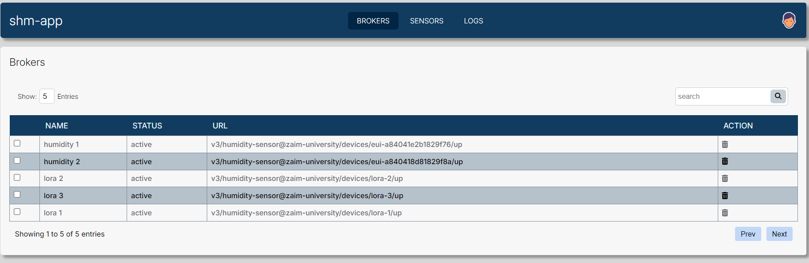
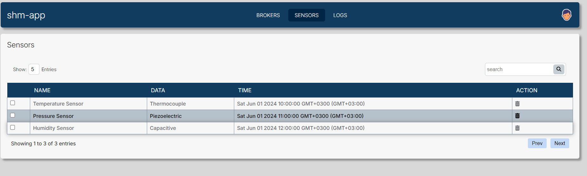
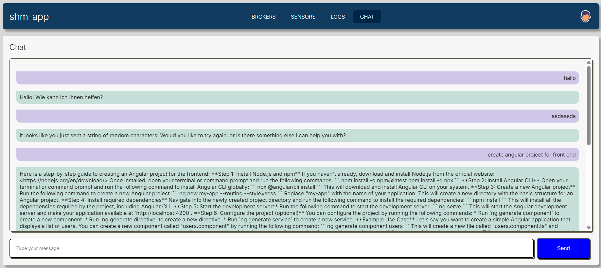

# shm-app
- it supports sensor monitoring data
- it supports data analysis and ai integration
- consits of back-end and front-end infrastructure
- communication with message broker mqtt
- current production example at https://shmapp.online

# Core Stack Overview:
- Backend: Django + Django REST Framework (DRF)
- Machine Learning: TensorFlow + PyTorch (for different models or inference engines)
- Database: MongoDB (via djongo or mongoengine)
- Frontend: angular (for interactive UI with real-time updates)
- Sensor Data Stream: Handled via WebSockets or polling endpoints

